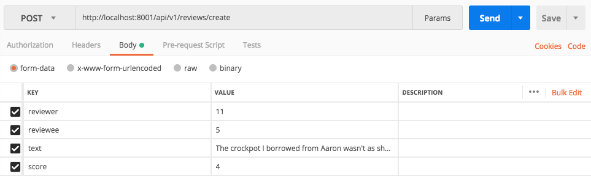
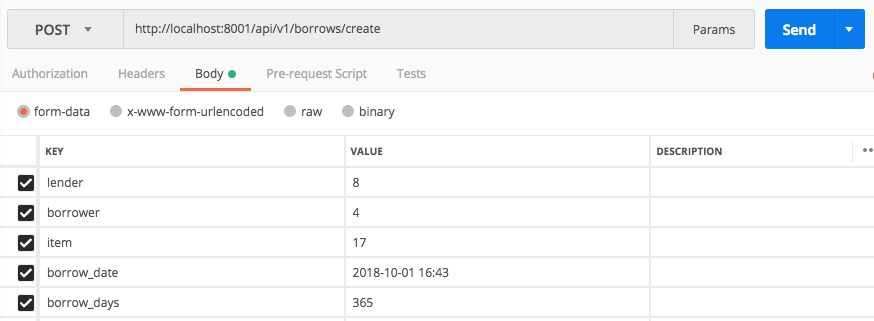

# Share

Our marketplace is a borrowing and lending site where users can post items they want to loan out for a small daily charge. People in the same area will be able to see all of the items around them and contact the owner to borrow them. Like Craigslist, Share will promote reuse of everyone's uncommonly used gadgets - like ladders, crockpots, wheelbarrows, and more - and also build a bond in the community.

## Models Overview

User
- first_name CHARFIELD
- last_name CHARFIELD
- email CHARFIELD
- phone_number CHARFIELD, not required
- overview TEXTFIELD
- zip_code CHARFIELD
- lender_rating_total INTEGERFIELD, not required
- lender_rating_count INTEGERFIELD, not required
- borrower_rating_total INTEGERFIELD, not required
- borrower_rating_count INTEGERFIELD, not required

Item
- owner FOREIGNKEY
- title CHARFIELD
- condition CHARFIELD
- description TEXTFIELD
- price_per_day DECIMALFIELD
- max_borrow_days INTEGERFIELD
- currently_borrowed BOOLEANFIELD, not required

Borrow
- lender FOREIGNKEY
- borrower FOREIGNKEY
- item FOREIGNKEY
- borrow_date DATETIMEFIELD
- borrow_days INTEGERFIELD

Review
- reviewer FOREIGNKEY
- reviewee FOREIGNKEY
- text TEXTFIELD
- score INTEGERFIELD

## API Overview

### Example routes

    /api/v1/users/4 
        - GET to return info about user with id 4, POST to update the user's info.
    /api/v1/items/17 
        - GET to return info about item with id 17, POST to update the item.
        - NOTE: cannot change the item's owner
    /api/v1/borrows/9
        - GET to return info about borrow with id 9, POST to update the borrow's info.
        - NOTE: cannot change lender, borrower, or item
    /api/v1/reviews/9 
        - GET to return info about review with id 9, POST to update the review.
        - NOTE: cannot change the reviewer or reviewee
    /api/v1/items/create 
        - POST to create a new item
    /api/v1/borrows/create 
        - POST to create a new borrow
        - NOTE: DateTimeField input format is YYYY-MM-DD HH:MM
    /api/v1/reviews/23/delete 
        - DELETE to delete review with id 23
    
### Example URLs that work with fixtures

    http://localhost:8001/api/v1/items/9/
    http://localhost:8001/api/v1/users/4/
    http://localhost:8001/api/v1/borrows/3/
    http://localhost:8001/api/v1/reviews/2/

## Postman example screenshots

